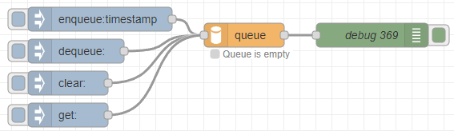
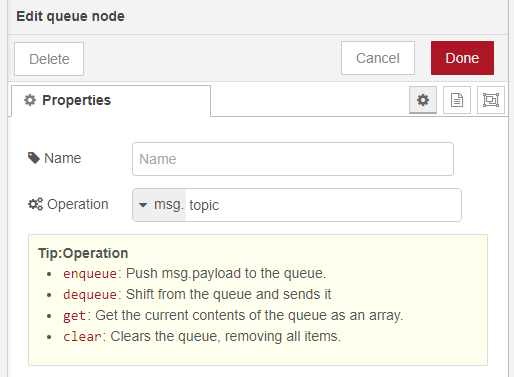
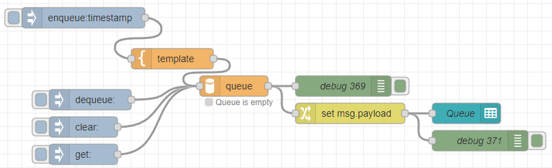
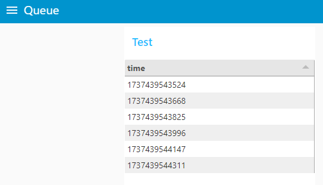

# node-red-contrib-queue
Node-RED node for handling queues

## Usage

Sample flow is in the examples folder.

You can change the function by specifying Operation.

In msg._queue, always output an array of queues.   
The values can be easily displayed by passing them to the ui-table node.  

